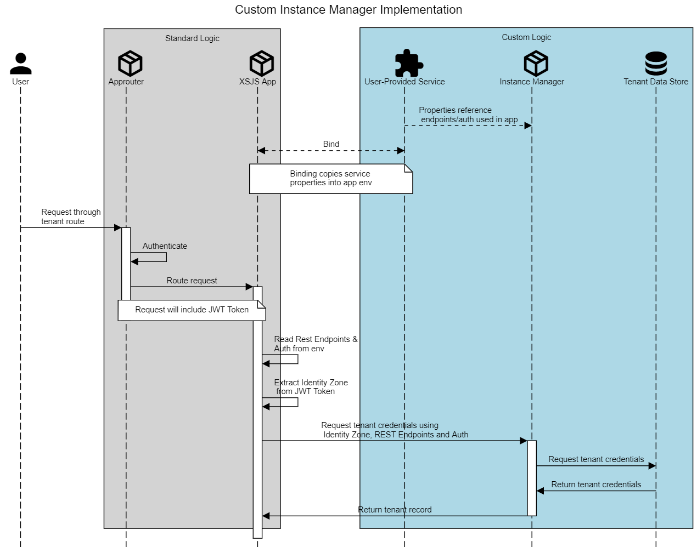

# Overview
This blog details one approach to implementing multitenancy in a Node.js application. The tenant isolation strategy used is schema isolation. In this scheme, each tenant is assigned its own HDI container. 

The application logic focuses on the `@sap/xsjs` package. A tenant-aware `xsodata` service is our primary goal. The target deployment environment is SAP Cloud Platform's Cloud Foundry (CF) environment.
## Background
Are you new to multitenancy? Do you not have a firm grasp of how it fits into the CF environment? If so, please check the following resources for some background first.
1. [Multitenancy Architecture on SAP Cloud Platform, Cloud Foundry environment][bg-1] - This post providers an excellent overview on multitenancy itself. It describes terminology and provides a context for how it fits into a business application.
2. [Developing Multitenant Applications on SAP Cloud Platform, Cloud Foundry environment][bg-2] - This blog provides implementation details on multitenancy within the CF environment. It defines the different types of tenant isolation and walks you through a sample application.
3. [Using SaaS Provisioning Service to develop Multitenant application on SAP Cloud Platform, Cloud Foundry Environment][bg-3]: This post covers the steps needed for onboarding and offboarding tenants within the CF environment.
4. [Sample Multi-tenant Cloud Application on SAP Cloud Foundry Environment][bg-4] - This GitHub repository really drills into all of the specific details on how to onboard/offboard tenants using HDI containers. I highly recommend reading through the whole README and developing a deep understanding of the code.

## Motivation
 With so many good resources already available, why the need for this post? Well, there was one noticeable gap in applying these concepts. No matter how hard I looked, there was never an example of using HDI containers at runtime. At first, I thought I found my solution with the [managed-hana service][mv-1]. I soon found that [this service is not available and will not be available until later this year][mv-2].
 
I now had confirmation that a gap exists.  I knew that if I wanted this to work I had to build it myself. 
## The Problem

I think the best way to illustrate the problem is to start with a code snippet.

```javascript
var xsjs  = require("@sap/xsjs");
var xsenv = require("@sap/xsenv");

var options = {
  redirectUrl : "/index.xsjs"
};

// configure HANA
try {
  options = Object.assign(options, xsenv.getServices({ hana: {tag: "hana"} }));
} catch (err) {
  console.log("[WARN]", err.message);
}

// start server
xsjs(options).listen(3000);
```

For those of you that don't recognize what's going on here, this is the basic logic needed to setup an `xsjs` service (_authorization being one key omission_).

The lines I want to draw attention to deal with the HANA configuration. What we're doing here is loading in a service that has the `hana` tag and setting that in our options. We pass those options into `xsjs` and off we go, using the information stored in that service to run our application. 

As it turns out, this all works great if your application only operates on a single HDI container. What happens if you're working in a context with one HDI container _per tenant_? You may try to bind each of those tenant HDI containers to the application. Will they get picked up and loaded into the `xsjs` options without a hitch? Not quite. In fact, for those of you familiar with how `xsenv.getServices()` works, you'll know that reading many services with the same tag results in an error. Let's say you clean up the call to load in environment data. Well, what you'll find is that `xsjs` also doesn't like multiple services with that `hana` tag.

It seems that the solution here will be a bit more complicated.

# Feasibility
So far, nothing we've seen in this problem space has been very promising. The logic you might write to configure the `xsjs` service can't handle multiple `hana` services. The community has also acknowledged that no standard service offering exists.

What are we to do? Well, the first thing you might want to do is make sure that this goal is even achievable. Luckily, the npm documentation for `xsjs` provides a clue on this:

> **Multitenant usage**
> In multitenant scenarios, the `hana` and `secureStore` properties can contain an object with the credentials of a _managed-hana_ (Instance Manager) service (created with the appropriate service plan) instead of the credentials of a _hana_ service. In this case the application will connect to a HANA system depending on the tenant (identity zone) of the incoming request.
> A managed service instance for the particular tenant should be created in advance and the corresponding database artefacts should be deployed prior to requesting the application with this tenant. Otherwise the processing of the request will be terminated with an error...


So the framework does, indeed, have multi-tenancy support. It just requires a managed hana service that we've learned is not available. But what if we examined how `xsjs` tries to interact with that unavailable service? If we're lucky, we'll find an interface that we can implement as a user provided service to try and mimic the behavior of that managed-hana service.

## Digging Deeper

Opening the `xsjs` module and performing a blanket search of the term _tenant_ was where I started in my search. This lead me to file named `DbOptions` which seemed to include the type of logic I was looking for. Even more intriguing, it included a dependency to `@sap/instance-manager`. 

Now I had never heard of this `instance-manager` package but it seemed to be precisely what I needed. Plugging the term into my favorite search engine yieled an entry in the standard SAP Node.js documentation to boot: [`@sap/instance-manager`][dd-1]. The most interesting part of that documentation is this table:
Property | Mandatory | Details
-------- | --------- | -------
user | x | User for authentication.
password | x | Password for the user.
post_managed_instance_url | x | REST endpoint used for creating a new service instance for a tenant.
get_managed_instance_url | x | REST endpoint used for getting the details about a specific tenant service instance.
get_all_managed_instances_url | x | REST endpoint used for getting the details about all instances (for all tenants).
delete_managed_instance_url | x | REST endpoint used for deletion of a service instance.
polling_interval_millis | | Defaults to 300. States how many milliseconds to wait between requests in the polling phase.
polling_timeout_seconds | | Defaults to 120. Sets a limit for the amount of time (in seconds) that can be spent in polling.
cache_max_items | | Default value is 500. States the capacity of the cache.
cache_item_expire_seconds | | Defaults to 600 (10 minutes). Number of seconds after which a cache entry expires.

What we can learn from this is that all we need to achieve multitenancy is an application to handle a REST requests for the instance management operations (Create, Get, Get All, Delete) and a custom user-service to map to these REST endpoints.

What we find in the documentation is consistent with what exists in the underlying code. Indeed, tracing the code from `xsjs` to the `instance-manager` reveals that the service binding provides the REST endpoints that load tenant information.

# Implementation
We now have proof that multitenancy is possible. We've also found that we can implement the interface used by the `instance-manager` to achieve this goal. What's left is building the solution.
## The Instance Manager Application
In the context of this problem, we're only looking to query the tenant information. This means we only need to worry about adding support for the Get and Get All REST endpoints. The Create and Delete endpoints are not in the scope of this blog as they related to tenant onboarding/offboarding. For more information on that I recommend these [two][bg-3] [links][bg-4].


### Endpoints
So in my case, I created a simple node application that can handle requests at the following two endpoints:
1. `GET /admin/subaccounts/` - To be mapped to the `get_all_managed_instances_url` of the user provided service
2. `GET /admin/subaccounts/{tenant_id}` - To be mapped to the `get_managed_instance_url` of the user provided service. Note the URL pattern of `{tenant_id}`, this is the pattern that XSJS will use when making the call so it must be followed.

The response structure for a single record expected by the `xsjs` module is as follows:
```json
{
    "tenant_id": "<TENANT_ID>",
    "status": "<STATUS>",
    "credentials": {
        "host": "<HOST>",
        "port": "<PORT>",
        "driver": "<DRIVER>",
        "url": "<URL>",
        "schema": "<SCHEMA>",
        "hdi_user": "<HDI_USER>",
        "hdi_password": "<HDI_PASSWORD>",
        "user": "<USER>",
        "password": "<PASSWORD>",
        "certificate": "<CERTIFICATION>"
    }
}
```
If this looks familiar, it should because the `credentials` object matches exactly what you'd find for an HDI container service key. The only additional information is the `tenant_id` and `status`. The `tenant_id` should store the tenant identifier of the tenant subaccount and the status should hold a value of `CREATION_SUCCEEDED`.

### Security
Both endpoints are protected using basic authentication where the `user` and `password` map to the corresponding properties in the user-provided service. In following true [12-factor][im-1] methodologies, these credentials should be stored as environment variables. 

### Tenant Storage/Retrieval
The actual mechanism for storing and retrieving this information is left as an exercise. I recommend using the [referenced GitHub repository][bg-4] as a guide.
## The User Provided Service
With the backing application complete, the last step is to create a user provided service that references those REST endpoints and to bind it to the application that makes use of the `xsjs` module.

The user provided service should include configuration that matches the properties required by the `instance-manager` module which means it should look something like this:

```json
{
	"tags": [
		"hana"
	],
	"user": "<User for basic auth in backing app>",
	"password": "<Password for basic auth in backing app>",
	"post_managed_instance_url": "https://<host>.<region>/admin/subaccounts/{tenant_id}",
	"get_managed_instance_url": "https://<host>.<region>/admin/subaccounts/{tenant_id}",
	"get_all_managed_instances_url": "https://<host>.<region>/admin/subaccounts/",
	"delete_managed_instance_url": "https://<host>.<region>/admin/subaccounts/{tenant_id}"
}
```
So what we've included here are all the mandatory properties expected by the `instance-manager` as well as a `hana` tag. You'll note that not only did we include the `get` and `get_all` but also endpoints for `post` and `delete`. This is to ensure that we meet the minimum requirements to mimic an `instance-manager` service. Those extra endpoints will not actually produce any results. 

With this configuration, we can create the new user provided service in CF:
```
cf cups hdi-tenant-manager -p config.json
```
and bind it to our js application:
```
cf bind-service app-js hdi-tenant-manager
```
and restage that application to ensure the binding is available:
```
cf restage app-js
```
## Deployment Considerations
In terms of deployment of these components, the dependencies work out this way:

```
JS Business App --> User Provided Service --> Instance Manager App
                 |                         |
                 Depends                   Depends
```
Ideally you'd be able to deploy everything in a single MTA but I don't think it's possible to extract a `url` property from an application and include as part of the configuration of a user-provided service resource. Given these limitations, I'd recommend the deploying in a sequence represented in the above diagram:
1. Instance Manager App - This is first so we can establish a URL for the REST Endpoints
2. User Provided Service - This is second so that we can take the URL from the Instance Manager App
3. JS Business App - This is last as it depends on the User Provider Service

## The Big Picture
So how does this all fit together in a full-stack CF application? I've tried my best to summarize it with this diagram:


### Standard Logic
The gray box surrounding the Approuter and XSJS apps indicates standard functionality. As long as your approuter and XSJS applications are setup according to SAP standards everything will work as expected. 

As you can see, the XSJS logic will automatically extract identity zone information from the user authorization and it will also load in the instance manager endpoints and authentication credentials. It will use that information to make the call to the custom instance manager service and then use the resulting credentials to ensure proper tenant discrimination.

### Custom Logic
The light blue box marks the custom logic detailed in this post. It consists of the instance manager application, the user-provided service which allows for access to the instance manager application as well as some persistent storage of tenant information.

As long as you use the conventions detailed in this blog, this custom logic will be compatible with the standard logic detailed above.

# Conclusion
Hopefully this blog has provided some insight into how to apply multi-tenant concepts at runtime using tenant isolation by HDI container. I may also provide a sample app on GitHub if people would find it helpful.

# Appendix
The relevant package versions for applications referenced this blog were:
- `@sap/xsjs`: `3.3.7`
- `@sap/approuter`: `5.13.0`
- `@sap/xsenv`: `1.2.9`

[bg-1]: https://blogs.sap.com/2018/09/26/multitenancy-architecture-on-sap-cloud-platform-cloud-foundry-environment/
[bg-2]: https://blogs.sap.com/2018/09/17/developing-multitenant-applications-on-sap-cloud-platform-cloud-foundry-environment/
[bg-3]: https://blogs.sap.com/2018/10/25/using-saas-registry-to-develop-multitenant-application-on-sap-cloud-platform-cloud-foundry-environment/
[bg-4]: https://github.com/abh1kg/sap-cf-multi-tenant-application/tree/hana
[mv-1]: https://help.sap.com/viewer/4505d0bdaf4948449b7f7379d24d0f0d/2.0.03/en-US/73c1d18a6d464f4fadcd5eaeb7c965f6.html
[mv-2]: https://answers.sap.com/answers/774034/view.html
[dd-1]: https://help.sap.com/viewer/4505d0bdaf4948449b7f7379d24d0f0d/2.0.03/en-US/54513272339246049bf438a03a8095e4.html#loio54513272339246049bf438a03a8095e4__section_uqz_y3k_xz
[im-1]: https://12factor.net/config
